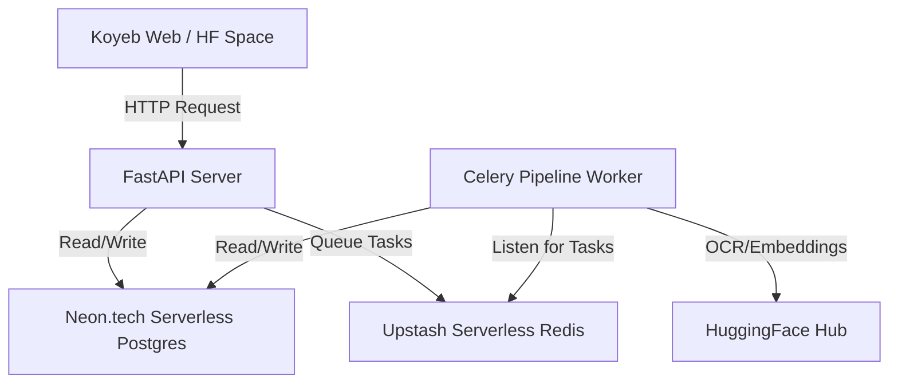

# Implementation Plan - Free Tier Deployment of MedScan AI Backend

This document details the configuration and architecture for deploying the MedScan AI backend completely on free tiers.

## Current Setup & Progress
- [x] Backend repository successfully pushed to [PPC2001/MedScan-AI](https://github.com/PPC2001/MedScan-AI.git).
- [x] Excluded `frontend/` using `.gitignore` parameters.
- [x] Configured settings to auto-convert incoming postgres URLs to `postgresql+asyncpg://` for async engines.
- [x] Created `Dockerfile` using Python 3.12 slim to build a single-container service.
- [x] Created `start.py` process manager to launch both FastAPI and Celery background worker in the same container, avoiding the need for a separate paid worker instance.
- [x] Pushed all updates to GitHub.

---

## 100% Free Architecture Map

To run the full stack for free, we will provision external free-tier database and message broker services and hook them to a container hosting service:



### 1. Database (PostgreSQL with pgvector) -> **Neon.tech**
- **Plan**: Neon provides a 100% free serverless PostgreSQL instance (including `pgvector` out-of-the-box).
- **Steps to setup**:
  1. Register at **[Neon.tech](https://neon.tech/)**.
  2. Create a new project named `medscan-db`.
  3. Copy the database connection string (starts with `postgresql://...`).

### 2. Message Broker (Celery Queue) -> **Upstash**
- **Plan**: Upstash provides a free Serverless Redis database (10K requests/day, which is perfect for development).
- **Steps to setup**:
  1. Register at **[Upstash.com](https://upstash.com/)**.
  2. Create a new Serverless Redis database named `medscan-redis`.
  3. Copy the Redis URL connection string (starts with `redis://...`).

### 3. Container App Server (FastAPI + Celery) -> **Koyeb** or **HuggingFace Spaces**
Since both services (FastAPI and Celery worker) are run in a single container via our custom `start.py`, they can be deployed together on a single free hosting instance:

#### Option A: Koyeb (Recommended)
- **Plan**: Koyeb has a free tier that provides 512MB RAM and runs containers 24/7.
- **Steps to deploy**:
  1. Register at **[Koyeb.com](https://www.koyeb.com/)**.
  2. Create a **New App**.
  3. Select **GitHub** as the deployment source and choose the `PPC2001/MedScan-AI` repository.
  4. In the configuration settings:
     - Set the builder type to **Dockerfile**.
     - Set the port to expose to **8000** (Koyeb will automatically map the HTTP port).
     - Add the environment variables detailed below.
  5. Click **Deploy**.

#### Option B: HuggingFace Spaces
- **Plan**: Free CPU instance running Docker SDK.
- **Steps to deploy**:
  1. Log into **[HuggingFace](https://huggingface.co/)**.
  2. Go to Spaces -> **Create New Space**.
  3. Give it a name (e.g. `medscan-ai-backend`), select **Docker** as the SDK, and choose **Blank** template.
  4. Once created, go to **Settings** and add your environment variables.
  5. Sync the codebase by adding HuggingFace as a Git remote locally and pushing to it, or linking the GitHub repository.

---

## Required Environment Variables

You must supply the following environment variables on the container platform configurations screen:

| Env Variable | Description | Source |
| :--- | :--- | :--- |
| `DATABASE_URL` | Neon connection URL | `postgresql://[user]:[pwd]@[host]/neondb?sslmode=require` |
| `REDIS_URL` | Upstash connection URL | `redis://:[pwd]@[host]:[port]` |
| `XAI_API_KEY` | xAI / Grok developer key | Your Grok API Console |
| `HF_TOKEN` | HuggingFace Token | HuggingFace Account Settings |
| `API_KEY` | Backend API auth secret | Any secure random string (e.g. `medscan-prod-key-123`) |
| `APP_ENV` | Run context | Set to `production` |
| `LOG_LEVEL` | Log verbosity | Set to `INFO` |

---

## Verification Plan

Once deployed, verify the setup:

1. **Check Live App URL**:
   - Access `https://<your-app-subdomain>.koyeb.app/health` or `https://huggingface.co/spaces/<user>/<space>/health`
   - It should return `{"status":"ok","database":"connected","redis":"connected"}`.
2. **Postman/Curl Ping**:
   - Run a test command to check endpoint query authentication:
     ```bash
     curl --location 'https://<your-app-subdomain>.koyeb.app/query/' \
     --header 'Content-Type: application/json' \
     --header 'X-API-Key: <your-configured-api-key>' \
     --data '{"query": "Test query"}'
     ```
